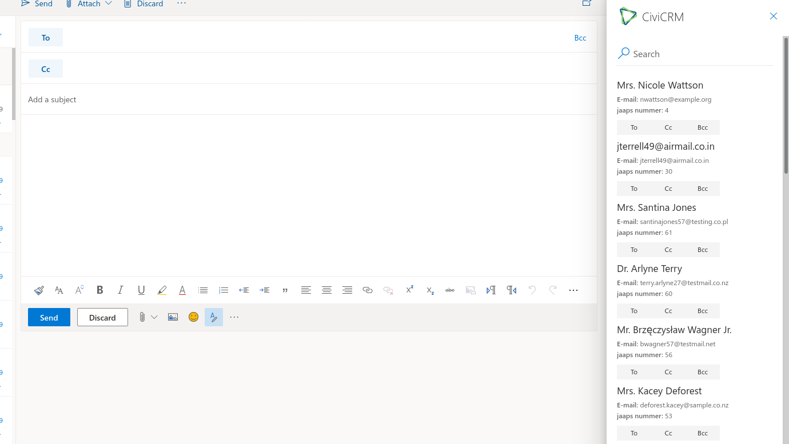

# Outlook 365 Integration

This extension integrates CiviCRM in Outlook 365.

The extension is licensed under [AGPL-3.0](LICENSE.txt).

## Requirements

* PHP v7.0+
* CiviCRM (Version 5.13 or newer)
* Data Processor (Version 1.1.0 or newer)
