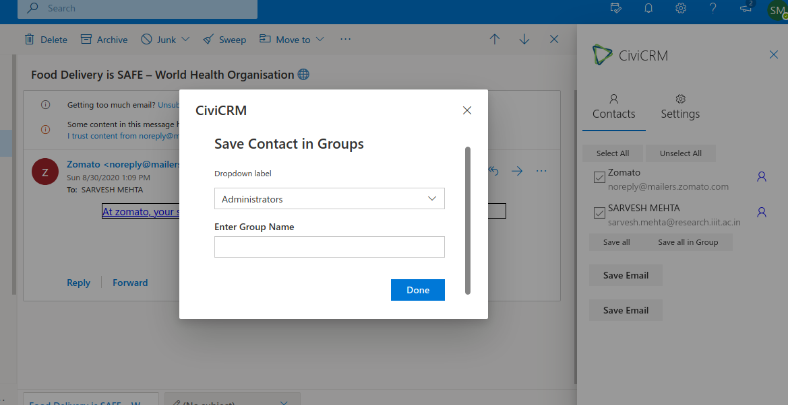
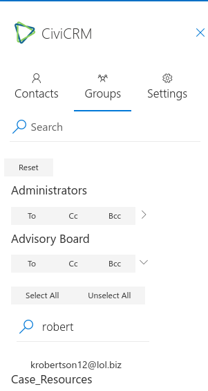

# Outlook 365 Integration for CiviCRM

This extension enables a user to query CiviCRM as an address book when using either Microsoft Outlook 365 Web and Desktop clients.
This extension generates a Microsoft Outlook 365 add-in which connects Outlook 365 to the CiviCRM site, this add-in can be deployed organisation-wide or on a per user basis. 

Features include:
* Search CiviCRM for contacts or groups.
* Search for contacts within a CiviCRM group.
* Ability to send email to all contacts in a mailing group.
* Select contacts across different mailing groups.
* Ability to CC or BCC email to one group while sending email to another group.
* Create CiviCRM contacts from the email recipients (To,CC,Sender).
* Create multiple CiviCRM contacts with a single click.
* Save multiple contacts to an existing group or create a new group in CiviCRM.
* Store the current email in CiviCRM as an Activity and associate with the email recipients.

This extension is licensed under [AGPL-3.0](LICENSE.txt).

# About the Authors

CiviCRM Outlook 365 integration was developed by:
* Jaap Jansma from [CiviCoop](https://civicoop.org)
* Sarvesh Mehta as part of the [Google Summer of Code 2020](https://summerofcode.withgoogle.com/archive/2020/projects/6234630803423232/) with mentoring from Justin Freeman from [Agileware](https://agileware.com.au)
* With new features and refactoring by the team at [Agileware](https://agileware.com.au)

You can say "Thanks!" and support your CiviCRM developers by contacting these companies for paid CiviCRM support and CiviCRM development services.
* [CiviCoop](https://civicoop.org)
* [Agileware](https://agileware.com.au)

Re-development of this extension was funded and performed as part of [Google Summer of Code 2020](https://summerofcode.withgoogle.com/archive/2020/projects/6234630803423232/). Status reports are available as these two Blog posts:
* [GSoC Project: Outlook365 Extension (2020-08-30)](https://civicrm.org/blog/sarvesh21/gsoc-project-outlook365-extension-0)
* [GSoC Project: Outlook365 Extension (2020-07-03)](https://civicrm.org/blog/sarvesh21/gsoc-project-outlook365-extension)

# Documentation

* [Getting started](docs/GettingStarted.md): Tutorial on how to install this extension and how to add the Add-in to Outlook 365.
* [How to add the phone number to Outlook 365](docs/HowToAddPhoneNumber.md): Tutorial explaining on how to add the phone number to Outlook 365. Or any other data from CiviCRM.

## Requirements

* PHP v7.0+
* CiviCRM (Version 5.13 or newer)
* Data Processor (Version 1.1.0 or newer)
* Microsoft Office365 