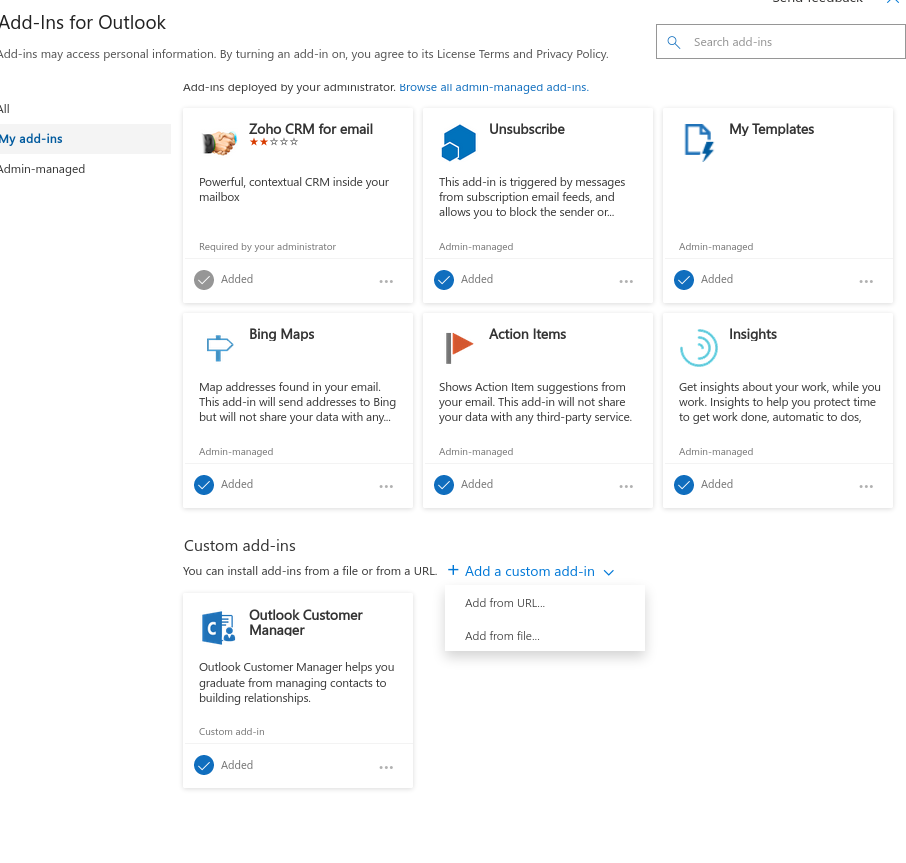

# Getting started

This page explains how you could integrate your CiviCRM with Outlook 365.

## Get the REST URL from CiviCRM, SITE Key, and API Key

Before we continue get your SITE KEY and your API KEY.
Also retrieve the rest url. This one could be under Support --> Developers --> API Explorer (v3)

[This answer on Stack Exchange](https://civicrm.stackexchange.com/a/31093/90) explains how to get the API Key and Site Key.

Make sure the API user has access to view contacts in your CiviCRM installation.

## Install data processor extension

Make sure you have installed the [data processor](lab.civicrm.org/extensions/dataprocessor) extension version 1.1.0 or newer.

## Install this extension

Download the extension from GitLab and upload it in your extension folder.

Go in CiviCRM to Administer --> System Setting --> Extension and press install next to Outlook 365 Integration

## Give the Anonymous User the permission to Access Outlook 365 files

_This could be different in your installation. Below is a description of how to do this when CiviCRM is installed in Drupal 7._

Go in Drupal to People --> Permissions and check **Access outlook 365 pages** in the column of the Anonymous User.
And press Save Permissions.

## Download the Outlook 365 Manifest file.

The manifest file is used to install the Add-In into Outlook 365.

In CiviCRM go to Administer --> Download Outlook 365 Manifest.xml
Safe this file on your computer and keep it for the next steps.

## Install the Add-In in Outlook 365

There are two ways of how you could install the add-in in Outlook 365: the first method
is that you make the add-in available in your Organization. The other method is installing it on a per user account.

### Install the add-in Organization wide

1. Go to the [Office 365 Admin console](https://admin.microsoft.com/AdminPortal)
2. Click on View all and the on Settings and then on Services and Add-ins
3. Click on Implement Add-in 
4. Click on Next
5. Click on Upload Add-In 
6. Select a file for upload and browse to your manifest.xml
7. Select who and how they can use your add-in. If you dont know leave the settings as it is (meaning the add-in is enabled for all users).
8. Click on implement

_**ps.** It could take a while before you can continue to the [First Use](#first-use-per-user) section._

_**ps2.** The screenshots are in Dutch so I had to guess the English names of the buttons, hope it makes sense._

### Install the add-in per user

1. Login into Outlook 365. Press new message
2. In the new message screen press on the ... in the bottom right corner of your screen 
3. Press Get Add-Ins
4. In the next screen go to My add-ins 
5. Press Add a custom add-in --> Add From File
6. Browse to the manifest file (which you have downloaded earlier from CiviCRM)
7. Press install 

The Add-in is now available in Outlook 365. But before you can actually use it you can to configire the Add-in with the CiviCRM
rest URL and the site key and api key.

## First Use (per user)

When you first use the Add-in you have to enter your CiviCRM settings.

_Due to the fact how Outlook 365 works. We can only store those settings on a per user base. So that means
that you have to do this step for every user in your outlook 365 installation_

1. Login in Outlook 365 And click on New message
2. In the new message screen press on the ... in the bottom right corner of your screen
3. Click on CiviCRM 
4. On your right hand side a screen appears with a grey button called Settings. Click on this button.
5. Enter you CiviCRM REST Url, Site Key and API Key. 
6. Click on Done

Now you are  ready to use this extension. If everything went well. You can search for contacts from CiviCRM in your Outlook new Message Screen.

