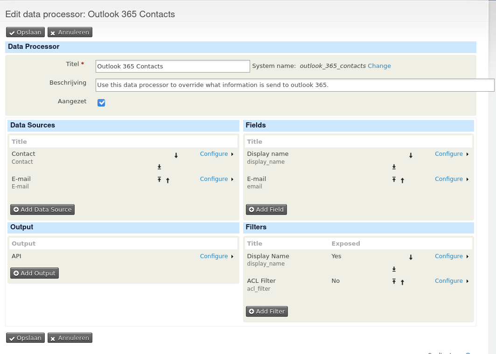
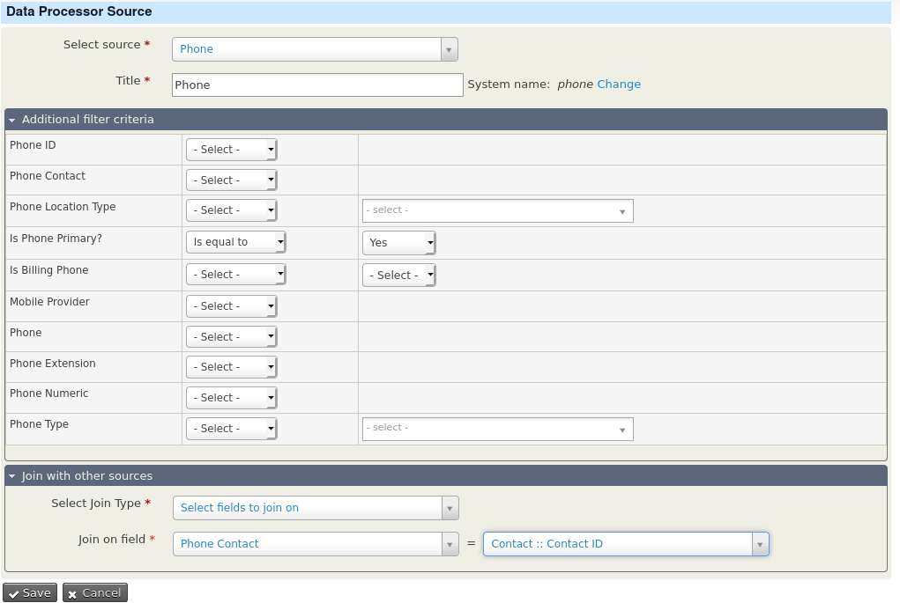
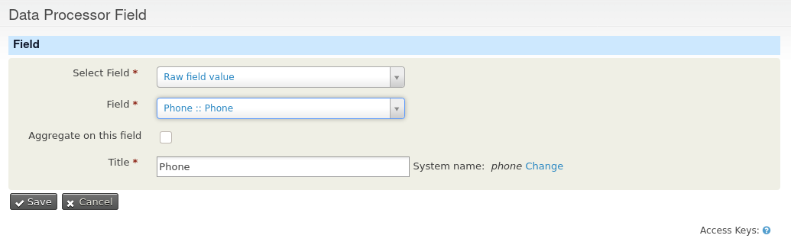
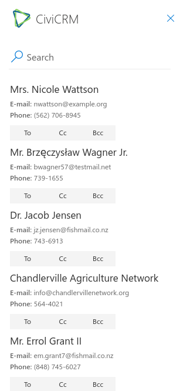

# How to add Phone number

What if you want to add the phone number beging exposed in Outlook 365? That is possible but it requires a few steps.
This is document explains how you could do this. And this could also be a starting point to add your own fields.

1. In CiviCRM go to Administer --> Data Processor --> Manage Data Processors
2. In the row of the data processor _Outlook 365 Contacts_ click on Actions --> Edit
3. In the next screen we could change the data processor. To make the phone number available we have to add a data source
for the primary phone number and we have to add a field displaying the phone number. 
4. Press Add Data Source
5. In the next screen select _Phone_ at source. In the section Additional Filter Criteria make sure _Is Phone is Primary_ is set to _Yes_
This way we display only the primary phone number of a contact.
6. In the section _Join with other sources_ select _Select fields to join on_ at _Join Type_ and then by _Join on Field_ select _Phone Contact_ in the first field and
_Contact :: Contact ID_ in the next field. With this latter we connect the phone data source to the data processor. (if you know SQL you will probably recognize this as a INNER JOIN)
This is how the phone data source looks like: 
7. Click save.
8. Now it is time to add the phone number as a field to the data processor. Click on Add Field
9. Select Field: _Raw Field Value_. This means we will display the data as how it is stored in the database.
10. Field: _Phone :: Phone_ this is the field we want to display
11. Give the field a title and a name (the name is proposed automatically)
The field looks like this 
12. Press Save.

Now you are done. Log in into Outlook and click on New Message --> ... --> CiviCRM and your screen looks like:

## How to revert the changes.

In the manage data processor screen you could always undo your changes. By pressing Revert in the status column (next to _Overridden_)
